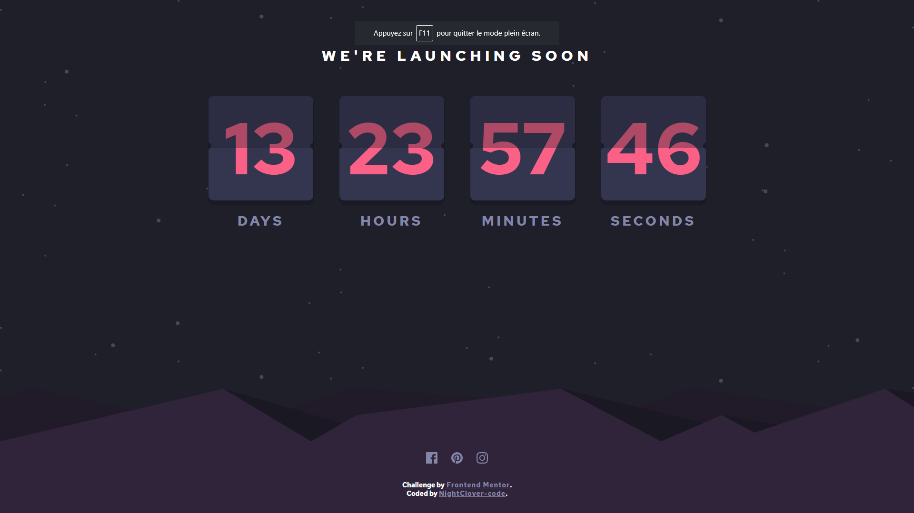

# Frontend Mentor - Launch countdown timer

## The challenge

The challenge was to build out this countdown timer and get it looking as close to the design as possible.

What users can do on this page:

- See hover states for all interactive elements on the page
- See a live countdown timer that ticks down every second (start the count at 14 days)
- **Bonus**: When a number changes, the card flips from the middle

## Giving Feedback 
  Any feedback on the code is welcome, thanks for sharing !
